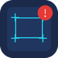

# 框选屏幕检测工具 / Screen Pattern Detector

> 一款 macOS 原生的屏幕区域监控工具。框选任意屏幕区域，把要找的图案存为模板（或直接设定目标文字），**持续盯防**该区域；一旦图案 / 文字再次出现即**播放提示音**，并可对每个响铃结果标记「命中 / 误报」以自动提升识别率。
> A macOS-native screen region watcher. Draw a box around any area, register a pattern (or target text), and it watches that region continuously — ringing a bell the moment the pattern/text reappears, with per-hit “hit / false-alarm” feedback that auto-improves accuracy.

> **作者 Author：banqiu**
>
> **许可证 License：MIT**（详见 [LICENSE](https://github.com/hwl513782273/screen-detector/blob/main/LICENSE)）。可自由使用、修改与再分发，须保留版权与许可声明。



[下载最新版 / Download](https://github.com/hwl513782273/screen-detector/releases/latest) · [问题反馈 / Issues](https://github.com/hwl513782273/screen-detector/issues)

---

## 中文

### 主要功能

- **框选监控区域**：手动框选一块屏幕区域作为监控范围（唯一监控区域来源）。框选遮罩为半透明蒙层，选区实时透出真实画面并标注尺寸。
- **两种检测引擎**
  - **图案模板匹配**（OpenCV `matchTemplate`）：框选图案存为模板，监控区再次出现即命中。
  - **文字检测**（Apple Vision OCR）：设定目标文字，监控区出现该文字即命中；支持多组「目标文字 + 独立提示音」。
- **三种匹配模式**
  - `仅图案`：只跑模板匹配。
  - `仅文字`：只跑 OCR 文字检测。
  - `文字优先·图案兜底`：优先文字命中；文字检测不到时再用图案命中兜底（二者其一命中即响铃）。
- **响铃开关**：出现 → 响铃；消失 → 自动停铃；可手动「⏸ 暂停响铃 / ▶ 启动响铃」，暂停后静音但不停止监控，点启动恢复。
- **命中反馈自学习**：对每个响铃结果标记「命中 / 误报」，动态调整每模板匹配阈值并精炼模板，降低误报、提升命中率；模板图像、阈值、学习样本均落盘，跨会话累积。
- **检测图案参与控制**：模板列表每项可勾选「参与检测」，取消则跳过该模板（保留模板与学习数据），多个勾选图案之间为「或」关系。
- **变化检测 / 学习反馈记录**：右侧面板实时显示命中状态（🟢 命中 / ⚪ 未命中），记录每次反馈明细。
- **持续监控架构**：主线程双 `QTimer` 驱动——`detect_timer` 按检测间隔抓帧并跑检测 + 响铃，`preview_timer` 独立高频刷新监控预览（不受检测节拍阻塞）。
- **屏幕录制权限处理**：启动即申请屏幕录制（TCC）权限；未授权时弹警告并在开始检测前拦截，授予后需完全退出重开生效。
- **保存图案图片**：把选中模板的原始图案导出为 PNG / JPEG 到任意位置。

> **平台说明 Platform Note：本工具为 macOS 原生应用（Python + PySide6 + OpenCV + Apple Vision + PyInstaller 打包为 `.app` / `.dmg`），暂无 Windows / Linux 版本。**

### 快速开始

1. 在 [Releases](https://github.com/hwl513782273/screen-detector/releases/latest) 下载对应系统的安装包（见下方「macOS 版本选择」）。
2. 把 `.app` 拖入「应用程序」；首次打开若被拦截，请右键「打开」以绕过 Gatekeeper。
3. 点「① 框选监控区域」选定要盯的屏幕区域。
4. 在「检测图案」里框选要找的图案作为模板（可加多个并勾选参与检测）。
5. 在「检测模式」里选匹配模式；若用文字，设定目标文字与提示音。
6. 点「开始检测」：监控区命中即响铃；用「命中 / 误报」反馈优化识别。

从源码运行：

> 源码仓库不含体积较大的二进制打包产物；普通用户请直接下载 Release 安装包。开发者从源码运行需自备 Python 3.11 + PySide6 + opencv-python-headless + numpy + pyobjc + mss + PyInstaller。

```bash
cd screen_detector
bash build.sh            # 默认按最新版本行为构建（arm64 / macOS 11+）
# 兼容包构建：
#   COMPAT_ARCH=x86_64 COMPAT_MIN_SYS=10.15 bash build.sh
```

一键发布（提交 + 打标签 + 推远程）：

```bash
bash git_release.sh 6.49.2 "本次改动说明"
git push origin main --tags
```

### macOS 版本选择

- **Apple Silicon（M1 及更新）· 基础版**：下载 `11.0-ScreenDetector-arm64.dmg`，macOS 11.0 及以上，Apple Silicon 原生运行。
- **Apple Silicon（M1 及更新）· 较新系统兼容包**：下载 `12.0-ScreenDetector-arm64.dmg`，macOS 12.0 及以上。
- **Intel Mac**：下载 `10.15-ScreenDetector-x86_64.dmg`，macOS 10.15 及以上，Intel 原生；在 Apple Silicon 上需通过 Rosetta 2 运行。

兼容包由同一套源码经 `COMPAT_ARCH` / `COMPAT_MIN_SYS` 环境变量注入构建，源码零改动。所有安装包**未签名、未公证**，Gatekeeper 可能提示；首次打开请右键「打开」。三个架构均通过离线启动冒烟与真实样本回归。

> 仓库「发行版 / Releases」的命名格式为：`支持最低版本-ScreenDetector-架构`（如 `11.0-ScreenDetector-arm64.dmg`）。


### 支持的检测类型 / Supported detection types

| 类型 / Type | 引擎 / Engine | 说明 / Notes |
|---|---|---|
| 图案模板匹配 / Pattern | OpenCV `matchTemplate` | 多模板「或」关系，可逐项勾选参与；支持命中反馈自学习精炼 |
| 文字检测 / Text | Apple Vision OCR | 多组「目标文字 + 独立提示音」；按检测间隔持续 OCR |
| 变化检测 / Change | 帧差比对 / frame diff | 监控区内容变化实时标注，配合学习反馈记录 |

### 差异化亮点 / Why this tool

同类「屏幕区域监控 + 命中提醒」工具通常只做图案模板匹配。本工具在以下几个维度做了增强：

- **文字检测**：基于 Apple Vision OCR，可直接监控「某段文字出现即响铃」，无需先截一张图当模板。
- **命中反馈自学习**：对每个响铃标记「命中 / 误报」，自动调阈值、精炼模板，数据落盘并跨会话累积，越用越准。
- **三种匹配模式**：`仅图案` / `仅文字` / `文字优先·图案兜底`，多勾选图案之间为「或」关系，灵活适配不同场景。
- **响铃开关 + 参与控制**：可「⏸ 暂停响铃 / ▶ 启动响铃」，每个模板可单独勾选是否参与检测，避免无关图案干扰。
- **原生 macOS 分发**：arm64（macOS 11 / 12）+ x86_64（macOS 10.15）三架构 DMG，内置屏幕录制（TCC）权限处理，拖入「应用程序」即用。

> 市面上已有一些开源的同思路工具，但把「图案匹配 + 文字 OCR + 自学习反馈 + 多模式」整合进单个原生 macOS 应用的方案并不多见。

---

## English

### Highlights

- **Region selection overlay**: manually draw a screen box as the watch area (the only source of the monitored region). The overlay is semi-transparent and shows the real content underneath with live dimension labels.
- **Two detection engines**
  - **Pattern template matching** (OpenCV `matchTemplate`): capture a pattern as a template; a reappearance in the watched region triggers a hit.
  - **Text detection** (Apple Vision OCR): set target text; a reappearance triggers a hit. Multiple “target text + dedicated sound” groups are supported.
- **Three match modes**
  - `Pattern only`: template matching only.
  - `Text only`: OCR text detection only.
  - `Text first, pattern fallback`: prefer text hits; fall back to pattern matching when text is not detected (either one triggers the bell).
- **Bell switch**: rings on appearance, auto-stops on disappearance; manual “⏸ Mute / ▶ Resume” keeps monitoring while silenced.
- **Hit-feedback self-learning**: mark each ring “hit / false-alarm” to dynamically tune per-template thresholds and refine templates, lowering false alarms and raising recall. Templates, thresholds, and samples persist across sessions.
- **Per-template participation control**: each template has an “enable” checkbox; disabling skips it (data preserved). Multiple enabled templates are OR-combined.
- **Change detection / learning log**: a side panel shows live hit status (🟢 hit / ⚪ none) and logs every feedback entry.
- **Continuous-monitoring architecture**: two main-thread `QTimer`s — `detect_timer` grabs a frame on the detect interval and runs detection + ringing, while `preview_timer` refreshes the preview independently at high frequency.
- **Screen-recording permission handling**: requests Screen Recording (TCC) at launch; warns and blocks detection until granted (a full quit-and-restart is required after granting).
- **Save template image**: export the selected template’s raw image as PNG / JPEG anywhere.

> **Platform Note: this is a native macOS app (Python + PySide6 + OpenCV + Apple Vision + PyInstaller, packaged as `.app` / `.dmg`). There is no Windows / Linux build.**

### Quick start

1. Download the build for your system from [Releases](https://github.com/hwl513782273/screen-detector/releases/latest) (see “Choose a macOS build” below).
2. Drag the `.app` into Applications; if blocked on first launch, right-click and choose “Open” to bypass Gatekeeper.
3. Click “① Select monitor region” to pick the screen area to watch.
4. In “Detection patterns”, draw the pattern to find as a template (add several and tick to enable).
5. Choose a match mode; if using text, set target text and sound.
6. Click “Start detection”: the bell rings on a hit; use “hit / false-alarm” feedback to improve recognition.

> The source repo excludes the large packaged binaries. Regular users should install the Release build. Developers need Python 3.11 + PySide6 + opencv-python-headless + numpy + pyobjc + mss + PyInstaller to run from source.

```bash
cd screen_detector
bash build.sh            # default build (arm64 / macOS 11+)
# compatibility build:
#   COMPAT_ARCH=x86_64 COMPAT_MIN_SYS=10.15 bash build.sh
```

One-shot release (commit + tag + push):

```bash
bash git_release.sh 6.49.2 "change notes"
git push origin main --tags
```

### Choose a macOS build

- **Apple Silicon (M1 or newer) · base**: use `11.0-ScreenDetector-arm64.dmg`, macOS 11.0+, native on Apple Silicon.
- **Apple Silicon (M1 or newer) · newer-OS compatibility**: use `12.0-ScreenDetector-arm64.dmg`, macOS 12.0+.
- **Intel Mac**: use `10.15-ScreenDetector-x86_64.dmg`, macOS 10.15+, native on Intel; requires Rosetta 2 on Apple Silicon.

Compatibility packages are built from the same source via `COMPAT_ARCH` / `COMPAT_MIN_SYS` with zero source changes. All installers are **unsigned and unnotarized**, so Gatekeeper may warn; right-click “Open” on first launch. All three architectures passed offline-launch smoke tests and real-sample regressions.

> Release asset naming: `min-version-ScreenDetector-arch` (e.g. `11.0-ScreenDetector-arm64.dmg`).

---

## 隐私与安全 / Privacy and security

- 全部检测在**本地**完成，不联网、不上传任何屏幕截图或模板数据。 / All detection runs **locally**; nothing is uploaded to a cloud service.
- 首次使用需在「系统设置 → 隐私与安全性 → 屏幕录制」授权本 App，否则监控画面会被 macOS 涂白。 / macOS Screen Recording (TCC) permission is required; without it the capture is blanked by the system.
- 安装包**未签名、未公证**，Gatekeeper 可能提示；请右键「打开」首次启动。 / Installers are unsigned and unnotarized; use right-click “Open” on first launch.

## 许可证 / License

**MIT License** — 版权归 **banqiu** 所有（2026）。

- 允许个人与商业免费使用、修改、再分发，须保留版权与许可声明。
- 完整条款见 [LICENSE](https://github.com/hwl513782273/screen-detector/blob/main/LICENSE)。

## 支持 / Support

本工具免费、开源、无广告。如果你觉得好用，欢迎在 GitHub 上点个 Star，或反馈问题帮它变得更好 —— 纯自愿。
This tool is free, open-source, and ad-free. If it helped you, a GitHub Star or an issue with feedback is warmly welcomed — entirely optional.
